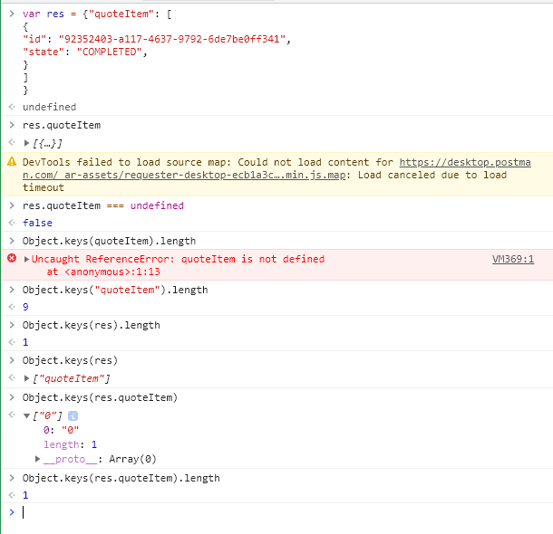

# BDD with CucumerJS - How to determine the assert

## Needs

Want to do a lot of asserts easily.

## Issues

Couldn't find very detailed documentation and plenty of examples.

## Achieve

I can easily do it with chrome DevTools!

